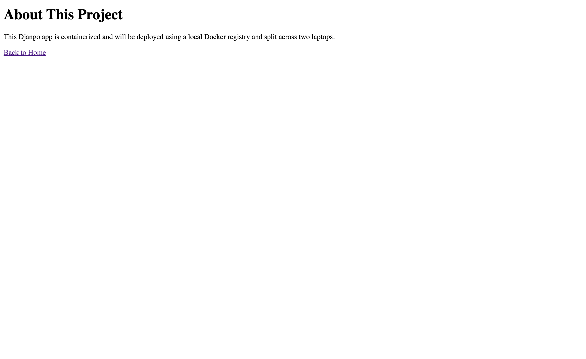

# 🐳 Local Django App Deployment (AWS ECS + ECR Simulation)

This project simulates deploying a Django application using Docker on a **local multi-device setup** — replicating AWS ECS (Elastic Container Service) and ECR (Elastic Container Registry) behavior without using actual cloud infrastructure.

---

## 📸 Demo

| App Running on Docker | Private Registry Running |
|-----------------------|--------------------------|
|  |  |

---

## 📁 Project Structure

```
02-Local-Django-ECS-Simulation/
├── .env                      # Environment variables
├── .gitignore                # Specifies intentionally untracked files to ignore
├── Dockerfile                # Docker build instructions
├── docker-compose.yml        # Docker Compose configuration
├── hello\_world\_django\_app/   # Django project source code
├── manage.py                 # Django's command-line utility
├── pages/                    # Django app for static pages
├── requirements.txt          # Python dependencies
├── sample-image/             # Sample images for README
│   ├── 01.png
│   └── 02.png
└── README.md                 # This file
````

---

## ⚙️ Tech Stack

- Python 3
- Django
- Docker
- Local Docker Registry (`registry:2`)
- Multi-machine simulation using two laptops (Mac M1 + Windows)

---

## ✅ Prerequisites

- Python 3 installed
- Docker installed and running
- Git (optional)
- Internet to pull base images

---

## 🚀 Step-by-Step Setup

### 🔹 Step 1: Initialize Django App

1. Create and activate a virtual environment:

   ```bash
   python3 -m venv venv
   source venv/bin/activate  # or venv\Scripts\activate on Windows
````

2. Install Django:

   ```bash
   pip install django
   ```

3. Create a Django project:

   ```bash
   django-admin startproject hello_world_django_app .
   ```

4. Run and test it locally:

   ```bash
   python manage.py runserver
   ```

---

### 🔹 Step 2: Add App Content

1. Modify `views.py`, `urls.py`, and `settings.py` to include a simple route.
2. Add a template or plain HTML response (like "Hello from local ECS simulation!").
3. Run the app and ensure it's rendering content correctly.

---

### 🔹 Step 3: \[Skipped] AWS ECR Setup

This step is **skipped**. Instead of using AWS ECR, we use a **local private Docker registry**.

---

### 🔹 Step 4: Create Docker Image

1. Create a `Dockerfile` in the root:

   ```Dockerfile
   FROM python:3.10-slim

   ENV PYTHONDONTWRITEBYTECODE 1
   ENV PYTHONUNBUFFERED 1

   WORKDIR /app

   COPY requirements.txt .
   RUN pip install -r requirements.txt

   COPY . .

   CMD ["python", "manage.py", "runserver", "0.0.0.0:8000"]
   ```

2. Build the Docker image:

   ```bash
   docker build -t hello-world-django-app:version1 .
   ```

3. Run the container:

   ```bash
   docker run -d -p 8000:8000 hello-world-django-app:version1
   ```

   Check the app at `http://localhost:8000`.

---

### 🔹 Step 5: Set Up Local Docker Registry

1. Run the registry:

   ```bash
   docker run -d -p 5000:5000 --name registry registry:2
   ```

2. Tag the image for your registry:

   ```bash
   docker tag hello-world-django-app:version1 localhost:5000/hello-world-django-app
   ```

3. Push it to your local registry:

   ```bash
   docker push localhost:5000/hello-world-django-app
   ```

4. Pull it from another machine (your second laptop):

   ```bash
   docker pull <your-main-laptop-ip>:5000/hello-world-django-app
   docker run -d -p 8000:8000 <your-main-laptop-ip>:5000/hello-world-django-app
   ```

   🔐 Make sure firewall or Docker network allows access between both machines.

---

## 🧠 Why This Project Is Valuable

* Simulates real-world cloud deployment pipelines locally
* Mimics AWS ECS (service/task/cluster) behavior
* No cost — 100% local and reproducible
* Demonstrates cross-machine coordination for DevOps

---

## 🚀 Docker Compose Setup

To simplify the setup and orchestration of the Django application and the local Docker registry, you can use `docker-compose.yml`.

1.  **Build and Run with Docker Compose:**

    ```bash
    docker-compose up --build -d
    ```

    This command will:
    *   Build the `hello-world-django-app` image.
    *   Start the `registry` service.
    *   Start the `django-app` service.

2.  **Access the Application:**

    The Django application will be accessible at `http://localhost:8000`.

3.  **Push to Local Registry (Optional, for multi-machine setup):**

    If you intend to simulate a multi-machine setup, you can push the image to your local registry:

    ```bash
    docker tag hello-world-django-app:version1 localhost:5000/hello-world-django-app
    docker push localhost:5000/hello-world-django-app
    ```

4.  **Stop Docker Compose Services:**

    To stop and remove the containers, networks, and volumes created by `docker-compose`:

    ```bash
    docker-compose down
    ```

---

## 🛠️ Possible Extensions

* Simulate auto-scaling by running multiple containers
* Integrate Nginx or Traefik for reverse proxy and load balancing
* Add local Prometheus/Grafana for monitoring simulation

---

## 📦 Sample Docker Commands Used

```bash
docker build -t hello-world-django-app:version1 .
docker run -d -p 8000:8000 hello-world-django-app:version1

docker run -d -p 5000:5000 --name registry registry:2
docker tag hello-world-django-app:version1 localhost:5000/hello-world-django-app
docker push localhost:5000/hello-world-django-app
```

---

## 🤝 Author

**Rimandeep Singh**

* 💼 DevOps | Cloud | Networking
* 🔗 [GitHub](https://github.com/RimandeepSingh)
* 🌍 Based in Germany

---

## ⭐ Support

If you find this helpful, consider giving a ⭐ on GitHub and sharing it with your network!

---

```

---

Let me know if you'd like:

- A `docker-compose.yml` file for easier orchestration
- A second README to put inside the Django app folder
- A shell script to automate this whole setup

Ready when you are.
```