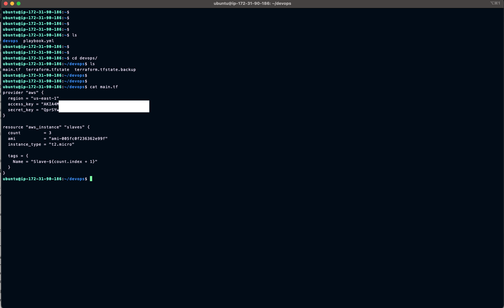
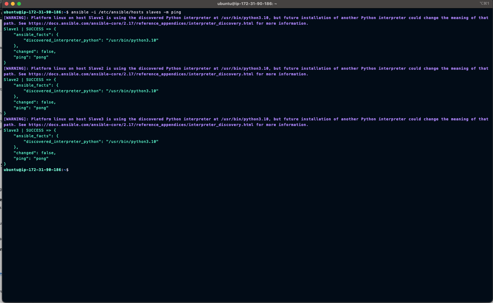
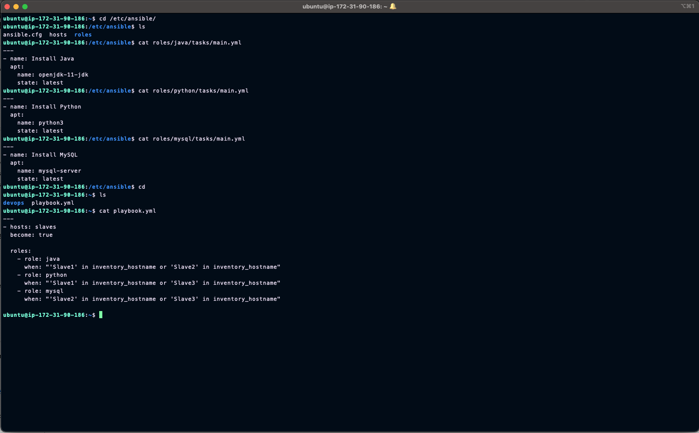
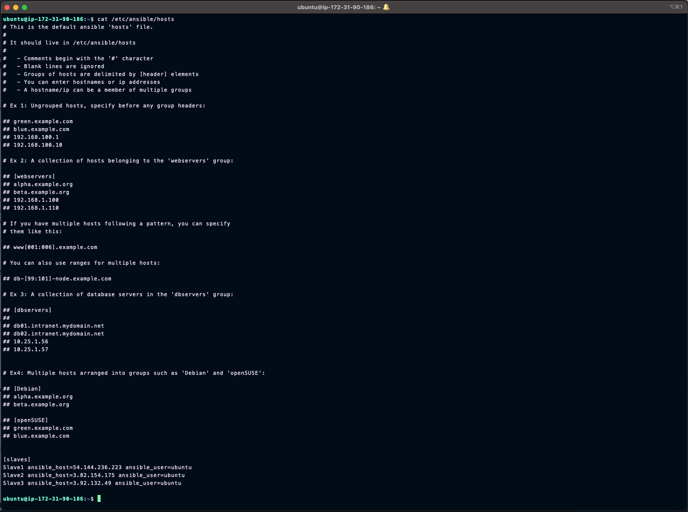
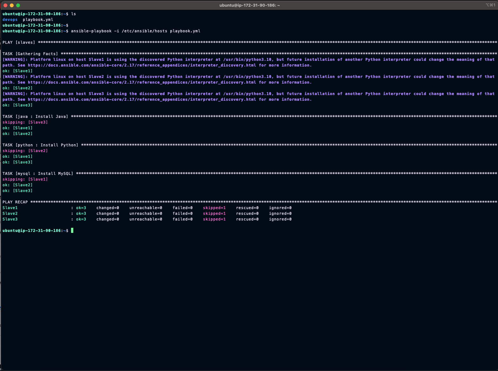

# Project 1: Infrastructure Automation with Terraform & Ansible

## Project Overview
This project demonstrates infrastructure automation using Terraform for AWS resource provisioning and Ansible for configuration management. It implements a multi-instance architecture with role-based software distribution.

## Architecture
- 1 Master Node
- 3 Slave Nodes with different software configurations:
  - **Slave 1**: Java + Python
  - **Slave 2**: Java + MySQL
  - **Slave 3**: MySQL + Python

## Implementation Details

### 1. Infrastructure Provisioning (Terraform)
- Created EC2 instances on AWS
- Configured security groups for SSH access
- Set up IAM roles and permissions
- Implemented infrastructure as code practices

### 2. Configuration Management (Ansible)
Implemented three distinct roles:
- **Java Role**: Installs OpenJDK latest
- **Python Role**: Installs Python 3
- **MySQL Role**: Installs and configures MySQL server

## Project Structure
```
03-terraform-ansible-devops/
├── terraform/
│   └── main.tf          # AWS infrastructure configuration
├── ansible/
│   ├── inventory.yml    # Host inventory file
│   ├── playbook.yml     # Main playbook for role distribution
│   └── roles/
│       ├── java/        # Java installation role
│       ├── python/      # Python installation role
│       └── mysql/       # MySQL installation role
└── screenshots/         # Implementation screenshots
```

## Setup Instructions

### Prerequisites
- AWS Account with appropriate permissions
- Terraform installed (v1.0.0 or later)
- Ansible installed (v2.9 or later)
- AWS CLI configured

### Terraform Deployment
```bash
cd terraform
terraform init
terraform plan
terraform apply
```

### Ansible Configuration
```bash
cd ansible
ansible-playbook -i inventory.yml playbook.yml
```

## Implementation Screenshots

1. **Infrastructure Setup**
   - 
   - 

2. **Configuration Management**
   - 
   - 
   - 

## Key Achievements
- Successfully automated infrastructure deployment using Terraform
- Implemented role-based configuration management with Ansible
- Created reusable roles for software installation
- Established secure communication between nodes
- Demonstrated Infrastructure as Code principles


---

## 🤝 Author

**Rimandeep Singh**

* 💼 DevOps | Cloud | Networking
* 🔗 [GitHub](https://github.com/rimansingh)
* 🌍 Based in Germany

---

## ⭐ Support

If you find this helpful, consider giving a ⭐ on GitHub and sharing it with your network!

---