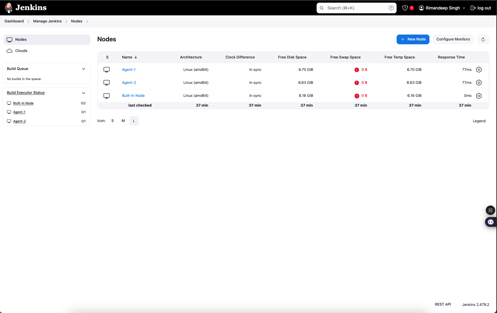
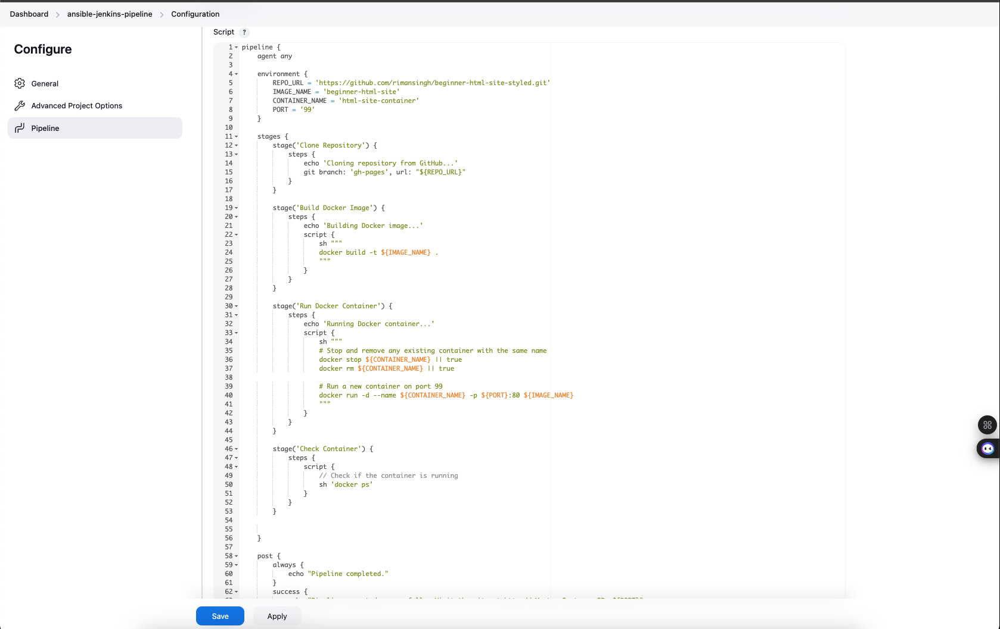
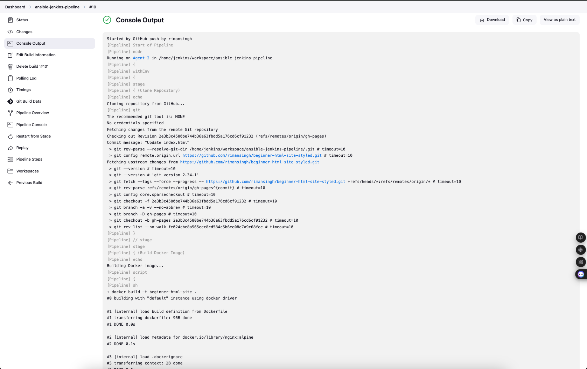
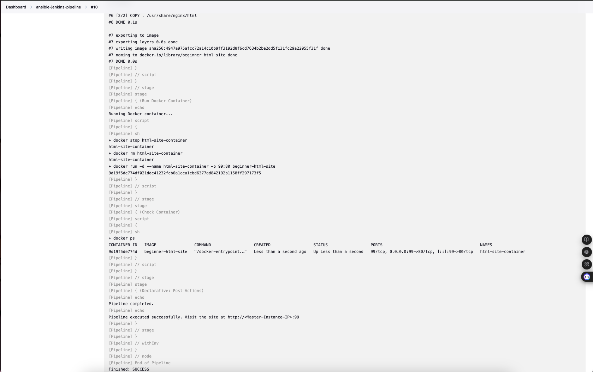
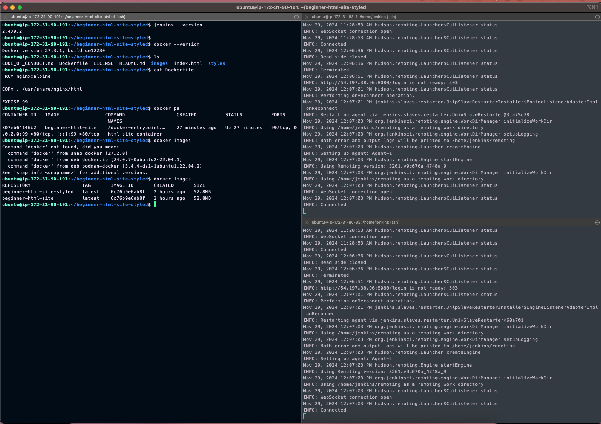
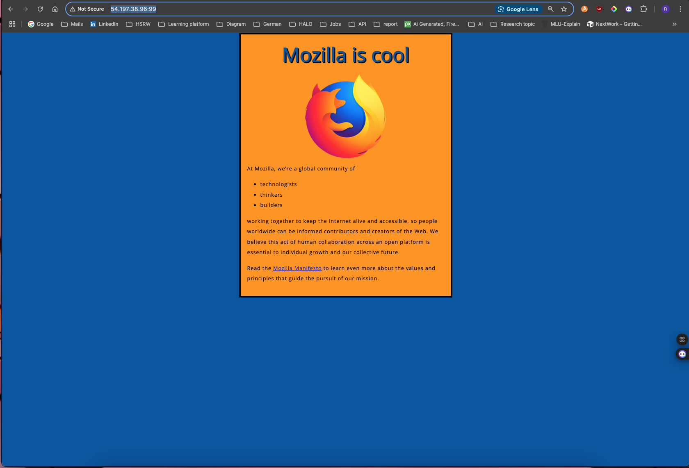
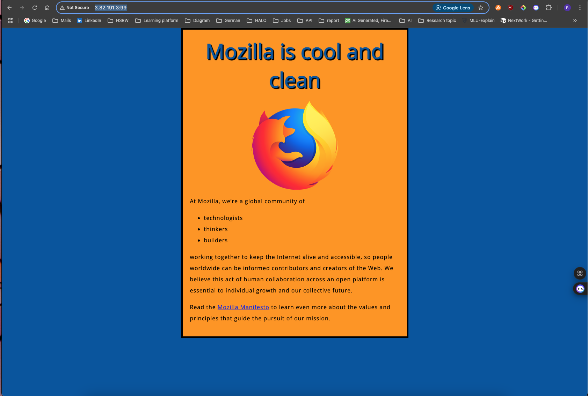

# Project 4: CI/CD Pipeline with Jenkins and Docker

## Project Overview
This project implements a complete CI/CD pipeline using Jenkins and Docker for automated web application deployment. The pipeline automatically builds and deploys a web application whenever changes are pushed to the GitHub repository.

## Architecture
- Jenkins Master-Agent Setup
- Docker-based Containerization
- GitHub Integration with Webhooks
- Automated Deployment Pipeline

## Implementation Details

### 1. Jenkins Configuration
- Set up Jenkins master with build agents
- Configured GitHub webhook integration
- Implemented pipeline as code using Jenkinsfile
- Established master-agent communication

### 2. Docker Implementation
- Created Dockerfile for web application
- Implemented container management
- Configured port mappings and networking
- Automated image building and deployment

## Project Structure
```
04-Jenkins-CI-CD-with-Docker/
├── docker/
│   └── Dockerfile        # Web application container configuration
├── jenkins/
│   └── Jenkinsfile      # CI/CD pipeline configuration
├── screenshots/         # Implementation documentation
└── README.md
```

## Pipeline Stages
1. **Checkout**: Fetch code from GitHub repository
2. **Build**: Create Docker image from Dockerfile
3. **Deploy**: Run container with the web application

## Setup Instructions

### Prerequisites
- Jenkins server with Docker support
- Docker installed on build agents
- GitHub repository with webhook configuration
- Required Jenkins plugins:
  - Docker Pipeline
  - GitHub Integration
  - Pipeline

### Jenkins Pipeline Setup
1. Create new Pipeline job in Jenkins
2. Configure GitHub webhook
3. Add Jenkinsfile from repository
4. Configure build triggers

### Docker Configuration
1. Install Docker on build agent
2. Configure Docker permissions
3. Test container build and deployment

## Implementation Screenshots

1. **Jenkins Setup**
   - 
- 

2. **Build Process**
   - 
- 
- 

3. **Deployment**
   - 
- 

## Key Achievements
- Implemented fully automated CI/CD pipeline
- Successfully integrated Jenkins with Docker
- Created reusable Docker configuration
- Established automated testing and deployment
- Implemented Infrastructure as Code principles

## Technical Specifications
- **Web Server**: Nginx
- **Container**: Docker
- **CI/CD**: Jenkins Pipeline
- **Version Control**: GitHub
- **Port Configuration**: 80 (container), 99 (host)

## Security Considerations
- Implemented secure Jenkins configuration
- Used proper Docker networking
- Configured appropriate port mappings
- Implemented access controls

## Code Snippets

### Dockerfile
This `Dockerfile` defines how the web application's Docker image is built. It uses a lightweight Nginx base image, copies the web application files, exposes port 80, and starts the Nginx server.

```dockerfile
FROM nginx:alpine

# Copy the web application files
COPY ./webapp /usr/share/nginx/html

# Expose port 80
EXPOSE 80

# Start nginx
CMD ["nginx", "-g", "daemon off;"]
```

### Jenkinsfile
This `Jenkinsfile` defines the CI/CD pipeline for the project. It automates the cloning of the repository, building of the Docker image, and running of the Docker container.

```groovy
agent any

environment {
    REPO_URL = 'https://github.com/rimansingh/beginner-html-site-styled.git'
    IMAGE_NAME = 'beginner-html-site'
    CONTAINER_NAME = 'html-site-container'
    PORT = '99'
}

stages {
    stage('Clone Repository') {
        steps {
            echo 'Cloning repository from GitHub...'
            git branch: 'gh-pages', url: "${REPO_URL}"
        }
    }

    stage('Build Docker Image') {
        steps {
            echo 'Building Docker image...'
            script {
                sh """
                    docker build -t ${IMAGE_NAME} .
                """
            }
        }
    }

    stage('Run Docker Container') {
        steps {
            echo 'Running Docker container...'
            script {
                sh """
                    # Stop and remove any existing container with the same name
                    docker stop ${CONTAINER_NAME} || true
                    docker rm ${CONTAINER_NAME} || true
                    
                    # Run a new container on the specified port
                    docker run -d --name ${CONTAINER_NAME} -p ${PORT}:80 ${IMAGE_NAME}
                """
            }
        }
    }

    stage('Check Container') {
        steps {
            echo 'Checking running containers...'
            script {
                sh 'docker ps'
            }
        }
    }
}

post {
    always {
        echo "Pipeline completed."
    }
    success {
        echo "Pipeline executed successfully."
    }
    failure {
        echo "Pipeline failed."
    }
}
```