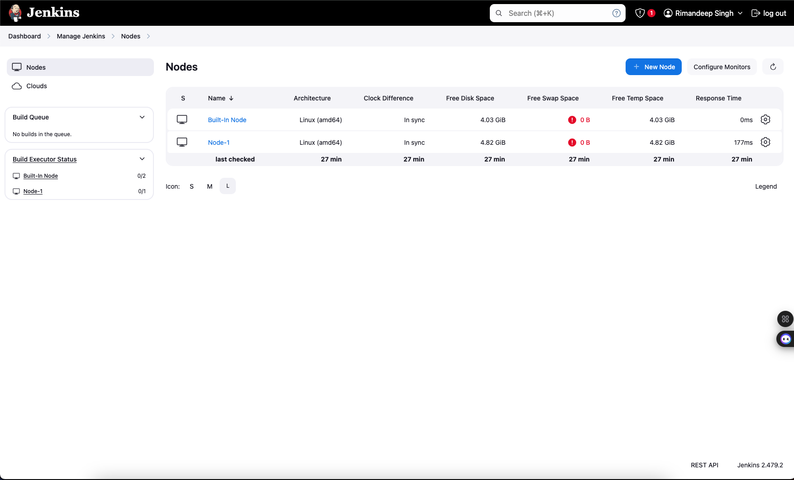

Here's a **README.md** file for your assignment:

---

# DevOps Assignment: Pipeline Creation for Website Deployment

## Objective

The objective of this assignment is to create a pipeline for the deployment of a website using Terraform, Ansible, and Jenkins.

---

## Prerequisites

1. **Terraform** installed on a manually created instance.
2. AWS account with permissions to create EC2 instances.
3. SSH key pair for password-less connections.
4. Ansible installed on the master machine.

---

## Steps to Implement

### 1. Manual Setup
- Launch an EC2 instance manually and install Terraform on it:
  ```bash
  sudo apt update
  sudo apt install -y gnupg software-properties-common curl
  curl -fsSL https://apt.releases.hashicorp.com/gpg | sudo gpg --dearmor -o /usr/share/keyrings/hashicorp-archive-keyring.gpg
  echo "deb [signed-by=/usr/share/keyrings/hashicorp-archive-keyring.gpg] https://apt.releases.hashicorp.com $(lsb_release -cs) main" | sudo tee /etc/apt/sources.list.d/hashicorp.list
  sudo apt update
  sudo apt install terraform
  terraform --version
  ```

---

### 2. Terraform Configuration
- Write a `main.tf` file to create 3 EC2 instances in the default VPC and Subnet.
- Ensure you provide the path to the user data script:
  ```hcl
provider "aws" {
    region = "us-east-1"
}

# Security group for instances
resource "aws_security_group" "instance_sg" {
    name        = "instance-sg"
    description = "Security group for instances"

    ingress {
        from_port   = 22
        to_port     = 22
        protocol    = "tcp"
        cidr_blocks = ["0.0.0.0/0"]
    }

    ingress {
        from_port   = 8080
        to_port     = 8080
        protocol    = "tcp"
        cidr_blocks = ["0.0.0.0/0"]
    }

    ingress {
        from_port   = 80
        to_port     = 80
        protocol    = "tcp"
        cidr_blocks = ["0.0.0.0/0"]
    }

    egress {
        from_port   = 0
        to_port     = 0
        protocol    = "-1"
        cidr_blocks = ["0.0.0.0/0"]
    }
}

# EC2 instances
resource "aws_instance" "example" {
    count         = 3
    ami           = "ami-0261755bbcb8c4a84"  # Ubuntu 20.04 LTS in us-east-1
    instance_type = "t2.micro"
    key_name      = "your-key-name"
    vpc_security_group_ids = [aws_security_group.instance_sg.id]

    user_data = count.index == 0 ? file("${path.module}/../scripts/user_data.sh") : null

    tags = {
        Name = count.index == 0 ? "Jenkins-Master" : "Jenkins-Slave-${count.index}"
        Role = count.index == 0 ? "master" : "slave"
    }
}

# Output the IPs
output "master_ip" {
    value = aws_instance.example[0].public_ip
    description = "The public IP of the Jenkins master"
}

output "slave_ips" {
    value = [for i in range(1, 3) : aws_instance.example[i].public_ip]
    description = "The public IPs of the Jenkins slaves"
}
  ```
- **Screenshot:**
  

---
- Commands to execute:
  ```bash
  terraform init
  terraform plan
  terraform apply
  ```

---

### 3. User Data Script
- Create a `user_data.sh` script for initial setup:
  ```bash
set -e

# Update system
echo "Updating system..."
sudo apt-get update
sudo apt-get upgrade -y

# Install required packages
echo "Installing required packages..."
sudo apt-get install -y software-properties-common
sudo apt-get install -y python3
sudo apt-get install -y ansible

# Install Java
echo "Installing Java..."
sudo apt-get install -y default-jdk

# Install Jenkins
echo "Installing Jenkins..."
wget -q -O - https://pkg.jenkins.io/debian-stable/jenkins.io.key | sudo apt-key add -
sudo sh -c 'echo deb https://pkg.jenkins.io/debian-stable binary/ > /etc/apt/sources.list.d/jenkins.list'
sudo apt-get update
sudo apt-get install -y jenkins

# Start Jenkins
echo "Starting Jenkins..."
sudo systemctl start jenkins
sudo systemctl enable jenkins

echo "Setup complete!"
  ```

---

### 4. Ansible Setup
- Install Ansible on one instance to act as the master.
- Configure password-less SSH for the two slave machines:
  ```bash
  ssh-keygen -t rsa
  ssh-copy-id user@slave-ip-1
  ssh-copy-id user@slave-ip-2
  ```
- Update `ansible/inventory.yml`:
  ```yaml
  all:
  children:
    jenkins_master:
      hosts:
        master:
          ansible_host: MASTER_IP  # Will be replaced with actual IP
    jenkins_slaves:
      hosts:
        slave1:
          ansible_host: SLAVE1_IP  # Will be replaced with actual IP
        slave2:
          ansible_host: SLAVE2_IP  # Will be replaced with actual IP
  vars:
    ansible_user: ubuntu
    ansible_ssh_private_key_file: ~/.ssh/your-key.pem
  ```
- **Screenshot:**
  
  

---

---

### 5. Ansible Playbook
- Write a playbook `install_java_jenkins.yml`:
  ```yaml
- name: Setup Jenkins Master
  hosts: jenkins_master
  become: yes
  tasks:
    - name: Install Java
      apt:
        name: default-jdk
        state: present
        update_cache: yes

    - name: Add Jenkins Repository Key
      apt_key:
        url: https://pkg.jenkins.io/debian-stable/jenkins.io.key
        state: present

    - name: Add Jenkins Repository
      apt_repository:
        repo: deb https://pkg.jenkins.io/debian-stable binary/
        state: present

    - name: Install Jenkins
      apt:
        name: jenkins
        state: present
        update_cache: yes
      notify: restart jenkins

    - name: Start Jenkins Service
      service:
        name: jenkins
        state: started
        enabled: yes

- name: Setup Jenkins Slaves
  hosts: jenkins_slaves
  become: yes
  tasks:
    - name: Install Java
      apt:
        name: default-jdk
        state: present
        update_cache: yes

    - name: Create Jenkins User
      user:
        name: jenkins
        shell: /bin/bash
        home: /home/jenkins

    - name: Create SSH Directory
      file:
        path: /home/jenkins/.ssh
        state: directory
        owner: jenkins
        group: jenkins
        mode: '0700'

  handlers:
    - name: restart jenkins
      service:
        name: jenkins
        state: restarted
  ```
- **Screenshot:**
  

---
- Run the playbook:
  ```bash
  ansible-playbook install_java_jenkins.yml
  ```

---

### 6. Jenkins Setup
- Access Jenkins on Master: `http://<master-ip>:8080`.
- Complete setup using the initial admin password (`/var/lib/jenkins/secrets/initialAdminPassword`).
- Add Slave 1 and Slave 2 as **Jenkins Agents**:
  - Navigate to **Manage Jenkins > Manage Nodes and Clouds > New Node**.
  - Configure SSH credentials for the agents.
- **Screenshot:**
  
  

---

---

### 7. Jenkins Pipeline Job
- Create a Jenkins pipeline job using the following script:
  ```groovy
  pipeline {
      agent any

      stages {
          stage('Clone Repository') {
              steps {
                  git branch: 'main', url: 'https://github.com/mdn/beginner-html-site-styled'
              }
          }
      }
  }
  ```
- **Screenshot:**
  
  

---

---

## Repository URL
The GitHub repository to be cloned:
[https://github.com/mdn/beginner-html-site-styled](https://github.com/mdn/beginner-html-site-styled)

---

## Deliverables
1. `main.tf` (Terraform configuration file).
2. `user_data.sh` script.
3. `install_java_jenkins.yml` (Ansible Playbook).
4. Screenshots or logs for:
   - Terraform execution.
   - Ansible playbook run.
   - Jenkins setup and pipeline execution.

---

## Notes
- Ensure all configurations are properly secured, including key management.
- Use default VPC and Subnet to avoid loss of marks.

---

## ⭐ Support

If you find this helpful, consider giving a ⭐ on GitHub and sharing it with your network!

---