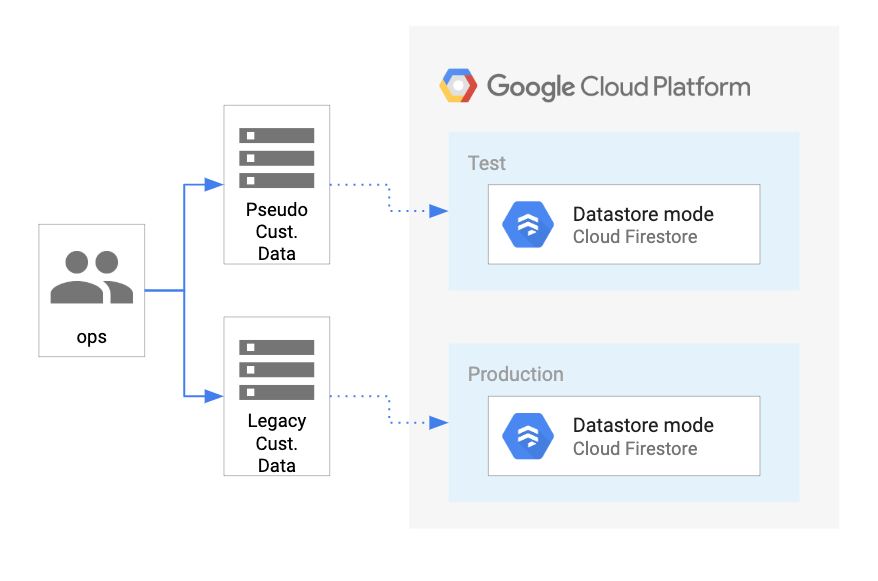

## Project Documentation: Lab 1 – Importing Data to a Firestore Database

**Part of the "Develop Serverless Apps with Firebase" Skill Badge course on Google Cloud Skills Boost**

This foundational project simulated a real-world business challenge for "Pet Theory," a veterinary clinic chain migrating legacy customer data into Google Cloud’s serverless Firestore database. It introduced me to cloud database provisioning, data migration scripting, and serverless best practices.

---

### 1. Project Overview

In this lab, I migrated customer data from a legacy CSV file into a modern, scalable, serverless NoSQL database — Google Cloud Firestore. The goal was to perform this migration efficiently without disrupting existing operations, leveraging Firestore’s native scalability and ease of use.

I built a Node.js script that parsed the CSV data and batch wrote the records to Firestore. To protect customer privacy during development, I also created a synthetic data generator script that produced realistic, but fake, test data. Cloud Logging was integrated to monitor script execution and ensure smooth operation.



---

### 2. Key Objectives & Skills Demonstrated

* Provision and configure a Firestore database in Google Cloud (Native Mode).
* Write a Node.js application to parse CSV files and migrate data to Firestore.
* Use the `@google-cloud/firestore` and `@google-cloud/logging` libraries for cloud API integration.
* Implement batch writes to Firestore for atomic, performant bulk data migration.
* Generate synthetic test data with the `faker` library to maintain data privacy during testing.
* Integrate Cloud Logging for operational visibility and auditing.
* Operate effectively within the Google Cloud Shell environment, managing dependencies and executing scripts via CLI.

---

### 3. Technology Stack

* **Database:** Google Cloud Firestore (Native Mode)
* **Runtime Environment:** Node.js on Google Cloud Shell
* **Libraries:**

  * `@google-cloud/firestore` — Firestore client
  * `@google-cloud/logging` — Cloud Logging client
  * `csv-parse` — CSV file parsing
  * `faker` — Generating synthetic data
* **Package Manager:** npm

---

### 4. Implementation Details & Code Highlights

#### Synthetic Data Generation: `createTestData.js`

To ensure data privacy, I created a script that generates realistic fake customer records and outputs them as a CSV file.

* Used `faker` to generate names, emails, phone numbers.
* Wrote headers and records to `customers_1000.csv` using Node’s `fs` module.
* Logged successful file creation in Cloud Logging for auditability.

```javascript
// Logging success after file creation
const success_message = `Success: createTestData - Created file ${fileName} containing ${recordCount} records.`;
const entry = log.entry(
  { resource: resource },
  { name: `${fileName}`, recordCount: `${recordCount}`, message: success_message }
);
log.write([entry]);
```

#### Data Import Script: `importTestData.js`

This script reads the CSV file and writes data into Firestore efficiently.

* Initialized Firestore and Logging clients.
* Parsed CSV stream using `csv-parse`.
* Implemented a batch write (`writeToFirestore`) that iterates over all records and queues writes atomically.

```javascript
async function writeToFirestore(records) {
  const db = new Firestore();
  const batch = db.batch();

  records.forEach(record => {
    const docRef = db.collection("customers").doc(record.email);
    batch.set(docRef, record, { merge: true });
  });

  await batch.commit();
  console.log('Batch executed successfully.');
}
```

* Called the batch write from the CSV parser callback.
* Logged success with Cloud Logging after batch commit.

```javascript
async function importCsv(csvFilename) {
  const parser = csv.parse({ columns: true, delimiter: ',' }, async (err, records) => {
    if (err) throw err;
    console.log(`Call write to Firestore`);
    await writeToFirestore(records);
    console.log(`Wrote ${records.length} records`);
    
    const success_message = `Success: importTestData - Wrote ${records.length} records`;
    const entry = log.entry({ resource: resource }, { message: success_message });
    log.write([entry]);
  });
  await fs.createReadStream(csvFilename).pipe(parser);
}
```

---

### 5. Step-by-Step Execution Summary

1. **Provisioned Firestore database** in Native Mode via Google Cloud Console.
2. **Cloned the lab repository** and installed dependencies (`npm install`).
3. **Ran `createTestData.js`** to generate 1,000 synthetic customer records in CSV format.
4. **Executed `importTestData.js`**, importing CSV data into Firestore with batch writes.
5. **Verified the import** by inspecting 1,000 documents in the `customers` collection on Firestore Console.
6. **Confirmed logging entries** appeared in Google Cloud Logs Explorer for both data creation and import.

---

### 6. Outcome

This lab gave me hands-on experience migrating flat-file data into a cloud-native, serverless database. I mastered batch writing best practices to optimize performance and cost, generated safe test data to protect privacy, and integrated cloud monitoring for operational visibility. The exercise built a strong foundation for developing complex serverless applications on Google Cloud.

---