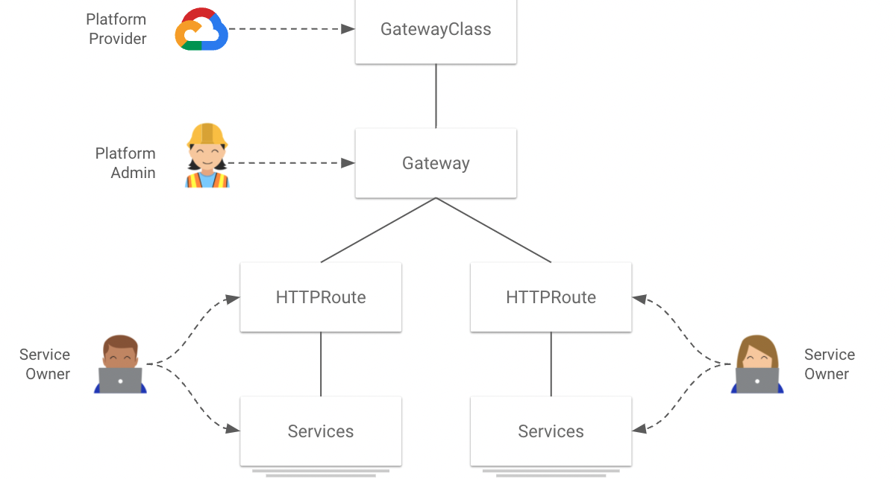
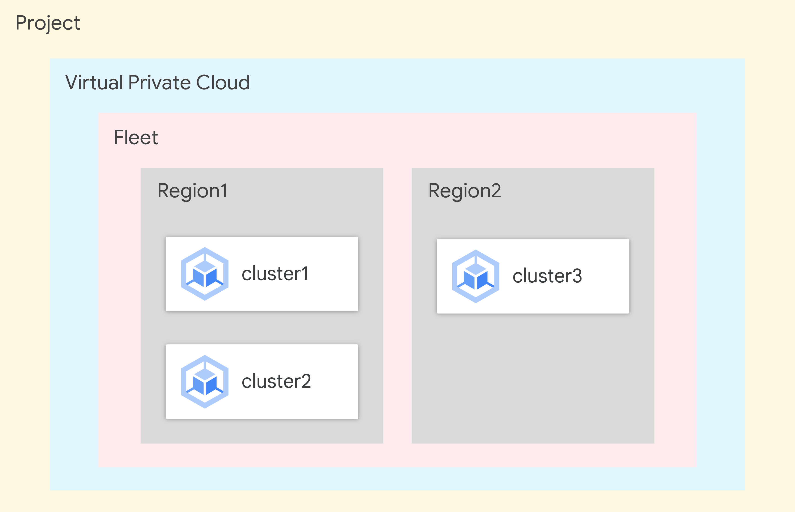
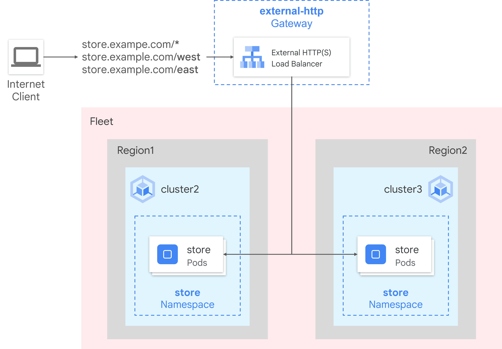

# **Deploying a Multi-Cluster Gateway Across GKE Clusters**

---



## **1. Project Overview**

This project demonstrates the implementation of a modern, highly available, and geographically distributed application architecture on Google Cloud using Google Kubernetes Engine (GKE) Enterprise. The core of this project is the deployment of a **Multi-cluster Gateway (MCG)**, which provides a unified, single entry point to manage and route traffic to services running across multiple GKE clusters in different regions.

This architecture solves critical challenges in cloud-native application delivery, including high availability, disaster recovery, centralized traffic management, and latency-based routing for a global user base.

---

## **2. Key Objectives & Accomplishments**

-   **Configured a GKE Enterprise Fleet:** Established a logical grouping of GKE clusters for centralized management and configuration.
-   **Provisioned Multi-Region Infrastructure:** Deployed three GKE clusters across two distinct Google Cloud regions to serve as the foundation for a distributed application.
-   **Implemented Multi-cluster Services (MCS):** Enabled seamless service discovery and communication between applications running in different clusters.
-   **Deployed a Multi-cluster Gateway (MCG):** Configured a single, global external load balancer to intelligently route traffic across the entire fleet.
-   **Engineered Advanced Traffic Routing:** Implemented path-based routing rules using `HTTPRoute` resources to direct users to specific clusters (`/east`, `/west`), showcasing granular control over traffic flow.

---

## **3. Architecture Diagram**

_(A simple diagram illustrating the concept)_

-   **GKE Enterprise Fleet:** A management layer that unifies `cluster1`, `cluster2`, and `cluster3`.
-   **Config Cluster (`cluster1`):** A dedicated cluster that acts as the control plane. It hosts the `Gateway` and `HTTPRoute` configurations.
-   **Workload Clusters (`cluster2` & `cluster3`):** These clusters, located in different regions, run the actual application pods.
-   **Multi-cluster Gateway Controller:** A Google-managed controller that observes the `Gateway` resource in the config cluster and provisions a Global External HTTP(S) Load Balancer.
-   **Multi-cluster Services Controller:** Enables services to be discoverable across clusters via `ServiceExport` and `ServiceImport` resources.
-   **Global External Load Balancer:** The single, public IP address that receives all user traffic and distributes it to the appropriate backend cluster based on the routing rules.

---

## **4. Technologies Used**

-   **Cloud Platform:** Google Cloud (GCP)
-   **Orchestration:** Google Kubernetes Engine (GKE), GKE Enterprise
-   **Kubernetes APIs:** Gateway API, Multi-cluster Gateway (MCG), Multi-cluster Services (MCS), `HTTPRoute`, `ServiceExport`, `ServiceImport`, `GatewayClass`
-   **CLI Tools:** `gcloud`, `kubectl`, Cloud Shell
-   **Configuration:** YAML

---

## **5. Step-by-Step Implementation & Commands**

---



### **Phase 1: Environment Setup & GKE Enterprise Enablement**

This phase prepares the Google Cloud project by enabling necessary APIs and creating a fleet to manage the clusters.

1.  **Enable GKE Enterprise and Create Fleet:**

    ```bash
    # Enable the required Anthos API for GKE Enterprise
    gcloud services enable anthos.googleapis.com

    # Create the fleet
    gcloud container fleet create --display-name="gke-enterprise-fleet"
    ```

### **Phase 2: Cluster Provisioning & Configuration**

Three GKE clusters are provisioned across two regions. Placeholders like `[PROJECT_ID]`, `[ZONE1]`, `[ZONE2]` should be replaced with actual lab values.

1.  **Create GKE Clusters:**

    ```bash
    # Create cluster1 and cluster2 in the first region (e.g., us-central1-a)
    gcloud container clusters create cluster1 \
      --zone=[ZONE1] \
      --enable-ip-alias \
      --machine-type=e2-standard-4 \
      --num-nodes=1 \
      --workload-pool=[PROJECT_ID].svc.id.goog \
      --release-channel=regular \
      --project=[PROJECT_ID] --async

    gcloud container clusters create cluster2 \
      --zone=[ZONE1] \
      --enable-ip-alias \
      --machine-type=e2-standard-4 \
      --num-nodes=1 \
      --workload-pool=[PROJECT_ID].svc.id.goog \
      --release-channel=regular \
      --project=[PROJECT_ID] --async

    # Create cluster3 in a second region (e.g., us-east1-b)
    gcloud container clusters create cluster3 \
      --zone=[ZONE2] \
      --enable-ip-alias \
      --machine-type=e2-standard-4 \
      --num-nodes=1 \
      --workload-pool=[PROJECT_ID].svc.id.goog \
      --release-channel=regular \
      --project=[PROJECT_ID]
    ```

2.  **Configure `kubectl` Contexts:**

    ```bash
    # Fetch credentials for all clusters
    gcloud container clusters get-credentials cluster1 --zone=[ZONE1] --project=[PROJECT_ID]
    gcloud container clusters get-credentials cluster2 --zone=[ZONE1] --project=[PROJECT_ID]
    gcloud container clusters get-credentials cluster3 --zone=[ZONE2] --project=[PROJECT_ID]

    # Rename contexts for easier switching
    kubectl config rename-context gke_[PROJECT_ID]_[ZONE1]_cluster1 cluster1
    kubectl config rename-context gke_[PROJECT_ID]_[ZONE1]_cluster2 cluster2
    kubectl config rename-context gke_[PROJECT_ID]_[ZONE2]_cluster3 cluster3
    ```

3.  **Register Clusters to the Fleet:**

    ```bash
    gcloud container fleet memberships register cluster1 \
      --gke-cluster [ZONE1]/cluster1 \
      --enable-workload-identity \
      --project=[PROJECT_ID]

    gcloud container fleet memberships register cluster2 \
      --gke-cluster [ZONE1]/cluster2 \
      --enable-workload-identity \
      --project=[PROJECT_ID]

    gcloud container fleet memberships register cluster3 \
      --gke-cluster [ZONE2]/cluster3 \
      --enable-workload-identity \
      --project=[PROJECT_ID]

    # Verify registration
    gcloud container fleet memberships list --project=[PROJECT_ID]
    ```

### **Phase 3: Enable Multi-Cluster Features**

---

.png)

Enable the MCS and MCG controllers for the fleet.

1.  **Enable Multi-cluster Services (MCS):**

    ```bash
    # Enable the MCS feature on the fleet
    gcloud container fleet multi-cluster-services enable --project [PROJECT_ID]

    # Grant necessary IAM permissions for the MCS importer service account
    gcloud projects add-iam-policy-binding [PROJECT_ID] \
      --member "serviceAccount:[PROJECT_ID].svc.id.goog[gke-mcs/gke-mcs-importer]" \
      --role "roles/compute.networkViewer" \
      --project=[PROJECT_ID]

    # Verify MCS is enabled
    gcloud container fleet multi-cluster-services describe --project=[PROJECT_ID]
    ```

 controller.png)

2.  **Enable Multi-cluster Gateway (MCG) Controller:**

    ```bash
    # 1. Enable the Gateway API on the designated config cluster (cluster1)
    # This installs the necessary Custom Resource Definitions (CRDs) for Gateway resources.
    gcloud container clusters update cluster1 --gateway-api=standard --zone=[ZONE1]

    # 2. Enable the MCG feature for the fleet, designating cluster1 as the config cluster
    gcloud container fleet ingress enable \
      --config-membership=cluster1 \
      --project=[PROJECT_ID] \
      --location=global

    # 3. Grant necessary IAM permissions for the Gateway controller's service account
    PROJECT_NUMBER=$(gcloud projects describe "[PROJECT_ID]" --format="value(projectNumber)")
    gcloud projects add-iam-policy-binding [PROJECT_ID] \
      --member "serviceAccount:service-${PROJECT_NUMBER}@gcp-sa-multiclusteringress.iam.gserviceaccount.com" \
      --role "roles/container.admin" \
      --project=[PROJECT_ID]

    # 4. Verify that the multi-cluster GatewayClass resources are available
    # The `-mc` suffix indicates they are for multi-cluster use.
    kubectl get gatewayclasses --context=cluster1

    # Expected Output (will include single-cluster and multi-cluster classes):
    # NAME                               CONTROLLER                  ACCEPTED   AGE
    # gke-l7-gxlb-mc                     networking.gke.io/gateway   True       ...
    # gke-l7-rilb-mc                     networking.gke.io/gateway   True       ...
    # ... (other classes)

    # 5. Verify MCG feature is enabled on the fleet
    gcloud container fleet ingress describe --project=[PROJECT_ID]
    ```

### **Phase 4: Deploy the Distributed Application**

Deploy a sample application and its services to the workload clusters (`cluster2` and `cluster3`).

1.  **Deploy Application Pods:**

    ```bash
    # Create the deployment manifest
    cat <<EOF > store-deployment.yaml
    kind: Namespace
    apiVersion: v1
    metadata:
      name: store
    ---
    apiVersion: apps/v1
    kind: Deployment
    metadata:
      name: store
      namespace: store
    spec:
      replicas: 2
      selector:
        matchLabels:
          app: store
      template:
        metadata:
          labels:
            app: store
        spec:
          containers:
          - name: whereami
            image: gcr.io/google-samples/whereami:v1.2.1
            ports:
              - containerPort: 8080
    EOF

    # Apply the deployment to both workload clusters
    kubectl apply -f store-deployment.yaml --context=cluster2
    kubectl apply -f store-deployment.yaml --context=cluster3
    ```

2.  **Create Services and Export them using MCS:**

    ```bash
    # Create and export services on cluster2
    cat <<EOF > store-west-service.yaml
    apiVersion: v1
    kind: Service
    metadata:
      name: store
      namespace: store
    spec:
      selector:
        app: store
      ports:
      - port: 8080
        targetPort: 8080
    ---
    kind: ServiceExport
    apiVersion: net.gke.io/v1
    metadata:
      name: store
      namespace: store
    ---
    apiVersion: v1
    kind: Service
    metadata:
      name: store-west-2
      namespace: store
    spec:
      selector:
        app: store
      ports:
      - port: 8080
        targetPort: 8080
    ---
    kind: ServiceExport
    apiVersion: net.gke.io/v1
    metadata:
      name: store-west-2
      namespace: store
    EOF
    kubectl apply -f store-west-service.yaml --context=cluster2

    # Create and export services on cluster3
    cat <<EOF > store-east-service.yaml
    apiVersion: v1
    kind: Service
    metadata:
      name: store
      namespace: store
    spec:
      selector:
        app: store
      ports:
      - port: 8080
        targetPort: 8080
    ---
    kind: ServiceExport
    apiVersion: net.gke.io/v1
    metadata:
      name: store
      namespace: store
    ---
    apiVersion: v1
    kind: Service
    metadata:
      name: store-east-1
      namespace: store
    spec:
      selector:
        app: store
      ports:
      - port: 8080
        targetPort: 8080
    ---
    kind: ServiceExport
    apiVersion: net.gke.io/v1
    metadata:
      name: store-east-1
      namespace: store
    EOF
    kubectl apply -f store-east-service.yaml --context=cluster3
    ```

### **Phase 5: Deploy Gateway and HTTPRoute**

---



Define the ingress behavior on the config cluster (`cluster1`).

1.  **Deploy the Gateway:**

    ```bash
    # Create the Gateway manifest
    cat <<EOF > external-http-gateway.yaml
    kind: Namespace
    apiVersion: v1
    metadata:
      name: store
    ---
    kind: Gateway
    apiVersion: gateway.networking.k8s.io/v1beta1
    metadata:
      name: external-http
      namespace: store
    spec:
      gatewayClassName: gke-l7-gxlb-mc # Specifies a multi-cluster external L7 load balancer
      listeners:
      - name: http
        protocol: HTTP
        port: 80
        allowedRoutes:
          kinds:
          - kind: HTTPRoute
    EOF

    # Apply to the config cluster
    kubectl apply -f external-http-gateway.yaml --context=cluster1
    ```

2.  **Deploy the HTTPRoute for Path-Based Routing:**

    ```bash
    # Create the HTTPRoute manifest
    cat <<EOF > public-store-route.yaml
    kind: HTTPRoute
    apiVersion: gateway.networking.k8s.io/v1beta1
    metadata:
      name: public-store-route
      namespace: store
    spec:
      parentRefs:
      - name: external-http
      rules:
      - matches:
        - path:
            type: PathPrefix
            value: /west
        backendRefs:
        - group: net.gke.io
          kind: ServiceImport # Target the MCS service from cluster2
          name: store-west-2
          port: 8080
      - matches:
        - path:
            type: PathPrefix
            value: /east
        backendRefs:
        - group: net.gke.io
          kind: ServiceImport # Target the MCS service from cluster3
          name: store-east-1
          port: 8080
      - backendRefs: # Default rule for all other paths
        - group: net.gke.io
          kind: ServiceImport # Target the combined MCS service
          name: store
          port: 8080
    EOF

    # Apply to the config cluster
    kubectl apply -f public-store-route.yaml --context=cluster1
    ```

### **Phase 6: Validation & Testing**

Verify that the load balancer is working and routing traffic correctly.

1.  **Get the External IP Address of the Gateway:**

    ```bash
    # Wait for the IP to be provisioned (this can take 5-10 minutes)
    EXTERNAL_IP=""
    while [ -z "$EXTERNAL_IP" ]; do
      echo "Waiting for external IP..."
      EXTERNAL_IP=$(kubectl get gateway external-http -n store --context cluster1 -o jsonpath='{.status.addresses[0].value}')
      [ -z "$EXTERNAL_IP" ] && sleep 10
    done
    echo "Gateway IP: $EXTERNAL_IP"
    ```

2.  **Test the Routing Rules:**

    ```bash
    # Test the default route (should go to the nearest cluster)
    curl http://${EXTERNAL_IP}

    # Test the /west route (should explicitly go to a pod in cluster2)
    curl http://${EXTERNAL_IP}/west

    # Test the /east route (should explicitly go to a pod in cluster3)
    curl http://${EXTERNAL_IP}/east
    ```

---

## **6. Conclusion & Key Takeaways**

This project successfully demonstrates the power of GKE Enterprise for managing complex, multi-cluster deployments. By leveraging the Gateway API with MCG and MCS, we achieved a sophisticated networking setup with a simple, declarative set of Kubernetes resources.

**Key benefits of this architecture include:**

-   **Centralized Control:** A single `Gateway` and `HTTPRoute` in one cluster manage traffic for an entire fleet.
-   **High Availability:** The application is resilient to the failure of an entire cluster or region.
-   **Operational Simplicity:** Application teams can manage their own routing (`HTTPRoute`) without needing to configure complex cloud load balancers directly.
-   **Improved Performance:** Traffic is automatically routed to the closest healthy backend, reducing latency for users.

---

## **Shout Out**

Special thanks to **Google Cloud Skills Boost** for providing the resources, labs, and learning platform that made this project possible. If you want to learn more about Google Cloud and hands-on cloud skills, check out [Google Cloud Skills Boost](https://www.cloudskillsboost.google/).
